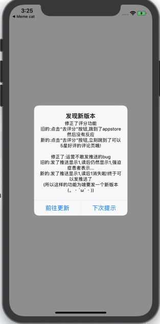

# SFVersionManager

[](https://travis-ci.org/coderflower/SFVersionManager)
[](https://cocoapods.org/pods/SFVersionManager)
[](https://cocoapods.org/pods/SFVersionManager)
[](https://cocoapods.org/pods/SFVersionManager)

## Example

1. 导入项目
```swift
import SFVersionManager
```
2. 在根控制器加载完成后执行
```swift
SFVersionManager.shared.checkVersion()
```
3. 以上代码会自动从 App Store 获取当前 Bundle Identifier对应的 app 最新版本,如果App Store版本大于当前版本会自动弹窗提示



## Requirements

## Installation

SFVersionManager is available through [CocoaPods](https://cocoapods.org). To install
it, simply add the following line to your Podfile:

```ruby
pod 'SFVersionManager'
```

## Author

Coder.flower, coder.flower@gmail.com

## License

SFVersionManager is available under the MIT license. See the LICENSE file for more info.
